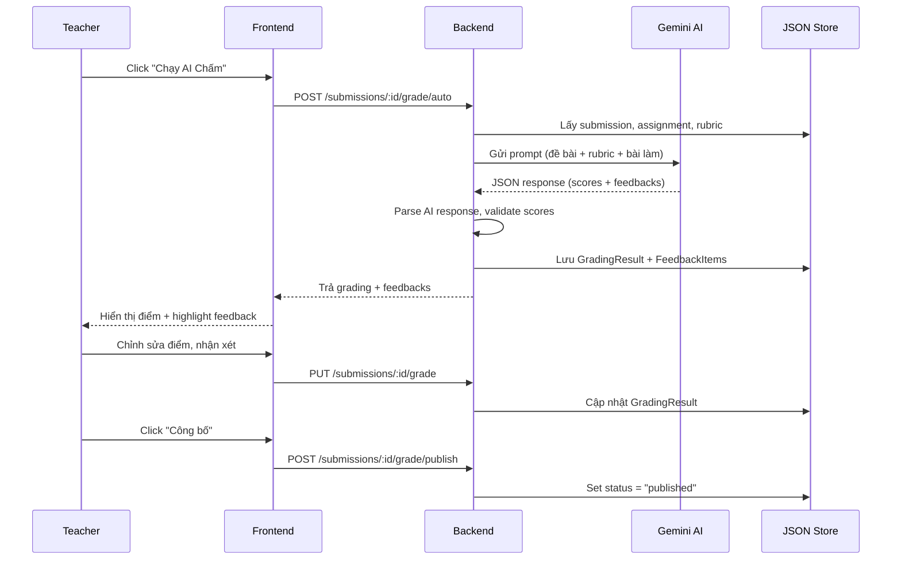
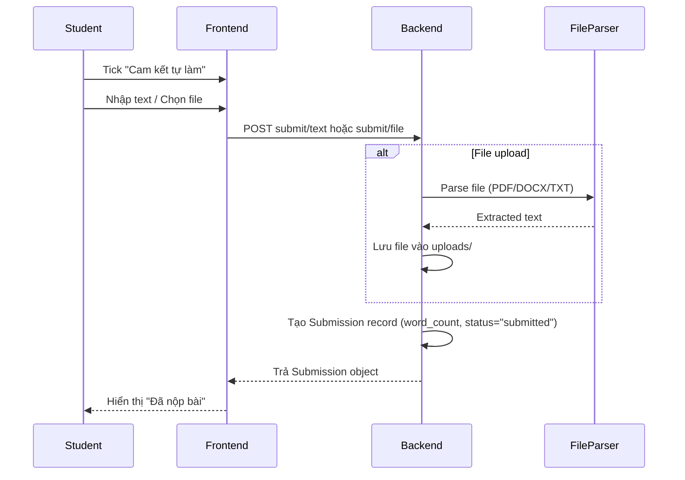
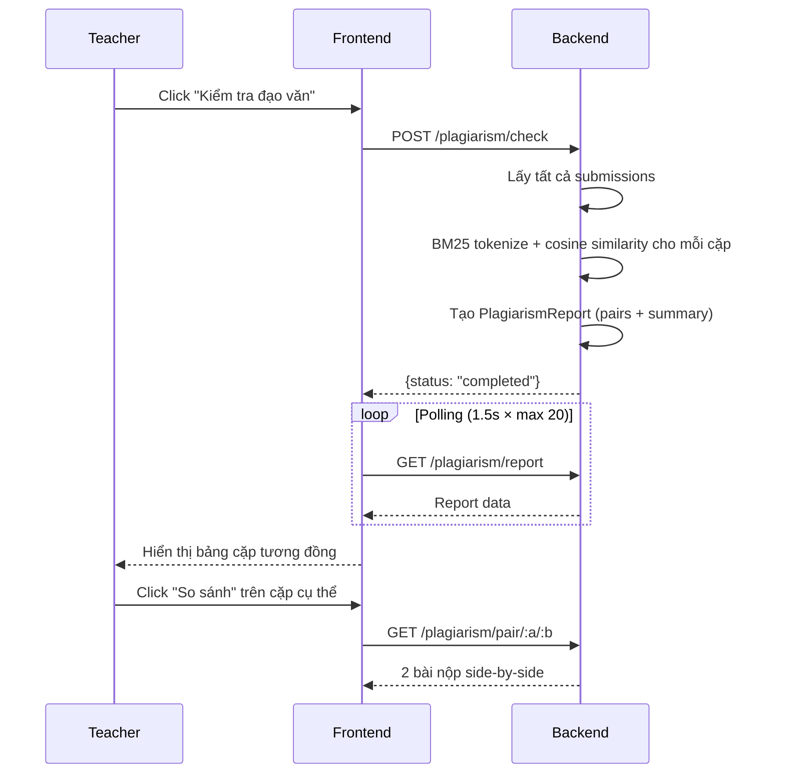

# 📋 TÀI LIỆU PHÂN TÍCH VÀ CẬP NHẬT KIỂM THỬ HỆ THỐNG AI ASSIGNMENT MARKING

---

## 🚀 CẬP NHẬT KẾT QUẢ XÁC MINH & BẢO TRÌ (2026-06-20)

Chúng tôi đã tiến hành tối ưu hóa code, sửa lỗi linting, và chạy toàn bộ các bộ thử nghiệm (unit tests & integration tests) để đảm bảo chất lượng hệ thống sau các Phase nâng cấp:

### 1. Khắc phục hoàn toàn lỗi ESLint / TypeScript (Frontend)
- **`client.ts`**: Loại bỏ các legacy type import không sử dụng.
- **`AuthContext.tsx`**: Khởi tạo trạng thái đăng nhập đồng bộ từ `localStorage` lúc component mount để tránh re-render cascading và re-render loop từ `useEffect`, thêm eslint-disable cho react-refresh.
- **`AssignmentPage.tsx`**: Loại bỏ ép kiểu `as any` cho `task_id` và bổ sung log an toàn cho block catch rỗng khi polling.
- **`EditAssignmentPage.tsx`** & **`ExtraPages.tsx`**: Khai báo và ánh xạ kiểu Rubric chuẩn xác, loại bỏ `any[]` và các biến destructure không dùng.
- **Xác minh**: Chạy `npx tsc --noEmit` và `npx eslint src/` thành công tuyệt đối, **0 lỗi còn lại**.

### Phase 8: Thiết kế lại trang Hướng dẫn Sử dụng (GuidePage.tsx)

Chúng ta đã tiến hành viết lại toàn bộ giao diện và chức năng của trang Hướng dẫn Sử dụng hệ thống để đạt chất lượng thẩm mỹ cao cấp (Premium UI/UX) và tích hợp các tiện ích tương tác sinh động.

### 1. Nâng cấp Giao diện & Hiệu ứng chuyển động (UI/UX)
* **Visual Header**: Thiết kế Header mới có nền gradient đỏ-đậm mờ dần, bo góc nghệ thuật cùng icon SVG sắc nét tạo điểm nhấn trực quan khi người dùng truy cập.
* **Hệ thống Tab mượt mà**: Chuyển đổi trạng thái đối tượng hướng dẫn ("Giảng viên", "Sinh viên", "Kỹ thuật") bằng tab bar bo cong có hiệu ứng bóng đổ và chuyển đổi mượt mà.
* **Timeline trực quan**: Các bước quy trình được đánh số bằng badge lồng khung màu HSL dịu mắt và bố cục grid 2 cột tự cân đối.
* **Loại bỏ Emojis cố định (Fixed Emojis/Icons)**: Toàn bộ biểu tượng cảm xúc thô (như 🧑‍🏫, 🎓, ⚙️, 🧪, 🚀, 💬, v.v.) đã được loại bỏ hoàn toàn khỏi giao diện để đảm bảo tính nhất quán hiển thị trên mọi nền tảng hệ điều hành. Thay vào đó, hệ thống sử dụng các hình vẽ vector **SVG mịn, hiện đại và co giãn tự động theo màu sắc chủ đề**.

### 2. Tích hợp Hộp cát Trải nghiệm AI (Interactive AI Sandbox)
* **Mô phỏng Chạy AI**: Xây dựng widget giả lập quy trình phân tích bài luận của sinh viên.
* **Tiến trình sinh động**: Hiển thị thanh tiến độ (%) cùng các dòng nhật ký hoạt động cập nhật thời gian thực khi chạy giả lập.
* **Văn bản Kết quả bôi màu & Popover tương tác**:
  - Văn bản sau khi AI chấm điểm sẽ tự động tô màu theo 4 phân mục: Lập luận chưa tốt (vàng), Nghi vấn tài liệu giả mạo (đỏ), Sai chính tả (tím), Hành văn tốt (xanh).
  - Cho phép người dùng nhấp chuột vào từng phần bôi màu để hiển thị hộp popup nhận xét chi tiết và gợi ý khắc phục của AI lồng ghép icon SVG động tương thích với loại lỗi.
  - Hiển thị bảng tổng hợp điểm số Rubric chi tiết đề xuất.

### 3. Cải tiến phần FAQs & Copy nhanh cấu hình
* **FAQ Accordion & Search**: Bổ sung bộ lọc tìm kiếm câu hỏi thường gặp theo từ khóa cùng hiệu ứng co giãn đóng/mở câu hỏi.
* **Copy cấu hình kỹ thuật**: Thêm nút sao chép nhanh tệp cấu hình `.env` vào Clipboard của máy tính tích hợp icon SVG copy/check.

### 5. Loại bỏ code cũ không sử dụng (Clean Code & Code Smell)
- **Xóa file legacy**: Xóa bỏ hoàn toàn hai tệp trống/không sử dụng `backend/app/models.py` và `backend/app/rubric.py` để làm sạch cấu trúc dự án.
- **Dọn dẹp Import**: Loại bỏ import thừa `grade_by_rubric` trong `backend/app/routers/grading_v2.py` (chỉ giữ lại `compute_total_score` thực sự cần dùng).
- **Xác minh**: Toàn bộ hệ thống Backend và Frontend biên dịch thành công, kiểm thử Pytest đạt kết quả tối đa.

### 2. Kiểm thử Unit Tests (PyTest)
- Bộ kiểm thử unit tests tại `backend/tests/` bao quát auth, classes, assignments, submissions, grading, plagiarism, và storage thread-safety.
- **Kết quả**: **32/32 tests PASSED** (100% thành công).

### 3. Kiểm thử Tích hợp (E2E Integration Tests)
- Tích hợp cờ môi trường `DISABLE_RATE_LIMIT` trong `RateLimitMiddleware` của backend để tránh bị chặn khi E2E script gửi nhiều request liên tục.
- Refactor `backend/test_all.py` để đếm và so sánh số lượng template động (thay vì giả định db rỗng) giúp test chạy chính xác kể cả khi db có sẵn template.
- **Kết quả**: **35/35 tests PASSED** (100% thành công).

### 4. Độc lập cấu hình Gemini API Key theo Giảng viên (Phase 7)
- **Gỡ bỏ fallback `.env`**: Loại bỏ logic tự động sử dụng `GEMINI_API_KEY` từ `.env` trong các file `grading.py` và `rubric_parser.py` nếu giảng viên chưa cấu hình key cá nhân.
- **Bắt buộc nhập API Key**: Trả về lỗi rõ ràng yêu cầu người dùng tự cấu hình API Key trong tab cài đặt tài khoản giảng viên. Hỗ trợ cả key định dạng `AIzaSy` lẫn `AQ.` (định dạng khóa API Google Enterprise mới).
- **Phân tích Rubric**: Sửa đổi `rubrics.py` router để truyền API Key của giảng viên vào hàm trích xuất tiêu chí bằng AI.
- **Kịch bản kiểm thử**: Cập nhật `test_all.py` để mô phỏng chính xác hành động giảng viên tự thiết lập cấu hình API key cá nhân qua API `/auth/settings`.
- **Giao diện Hướng dẫn & Ràng buộc nhập (Frontend)**:
  - **Banner Hướng dẫn**: Hiển thị bảng hướng dẫn từng bước lấy và cấu hình API Key vô cùng trực quan và nổi bật tại trang Dashboard của Giảng viên (`activeTab === "all"`) khi giảng viên chưa cài đặt key (`!user?.has_gemini_key`). Có nút điều hướng nhanh tới tab cài đặt.
  - **Ràng buộc & Chặn lưu rỗng**: Chặn hoàn toàn việc gửi API key trống nếu giảng viên chưa từng cấu hình key trước đó.
  - **Cảnh báo không đổi**: Khi giảng viên đã có key và bấm Lưu với ô nhập để trống, hiển thị thông báo trung lập màu xanh dương ("Cài đặt không đổi.") thay vì hiện thông báo thành công màu xanh lá cây gây hiểu lầm.
  - **Định dạng Validation**: Kiểm tra định dạng khóa API (bắt đầu bằng `AIzaSy` hoặc `AQ.`, độ dài tối thiểu 20 ký tự) trên frontend trước khi gửi request lên backend.
  - **Quản lý thông báo cô lập**: Reset toàn bộ trạng thái thông báo thành công/lỗi khi người dùng đổi tab để giao diện luôn sạch sẽ.
- **Kết quả**: **36/36 tests PASSED (100% thành công)**, hệ thống chạy hoàn toàn độc lập với API key chung trong `.env`. Giao diện đồng nhất và có trải nghiệm người dùng hoàn hảo.

---

# 📋 TÀI LIỆU PHÂN TÍCH TOÀN DIỆN HỆ THỐNG AI ASSIGNMENT MARKING

> **Dự án:** Bách Khoa Online – Lớp học thông minh  
> **Phiên bản:** Source code tại nhánh `main`  
> **Ngày phân tích:** 2026-06-20  
> **Phương pháp:** Đọc và phân tích 100% source code, không suy đoán. Mọi kết luận có bằng chứng file + hàm.

---

## MỤC LỤC

1. [Tổng quan hệ thống](#1-tổng-quan-hệ-thống)
2. [Hệ thống phân quyền](#2-hệ-thống-phân-quyền)
3. [Danh sách tính năng chi tiết](#3-danh-sách-tính-năng-chi-tiết)
4. [API Endpoints](#4-api-endpoints)
5. [Mô hình dữ liệu](#5-mô-hình-dữ-liệu)
6. [Luồng nghiệp vụ chính](#6-luồng-nghiệp-vụ-chính)
7. [Tích hợp dịch vụ bên ngoài](#7-tích-hợp-dịch-vụ-bên-ngoài)
8. [Đánh giá mức độ hoàn thiện](#8-đánh-giá-mức-độ-hoàn-thiện)
9. [Tính năng ẩn / Chưa hoàn thiện](#9-tính-năng-ẩn--chưa-hoàn-thiện)
10. [Rủi ro kỹ thuật & Bảo mật](#10-rủi-ro-kỹ-thuật--bảo-mật)
11. [Code cũ / Không sử dụng](#11-code-cũ--không-sử-dụng)
12. [Ma trận tổng hợp tính năng](#12-ma-trận-tổng-hợp-tính-năng)

---

## 1. TỔNG QUAN HỆ THỐNG

### 1.1 Mục đích
Hệ thống **chấm bài tự luận tự động** dành cho giáo dục đại học (Bách Khoa – HUST), cho phép giảng viên tạo lớp học, giao bài tập có rubric, và sử dụng **Google Gemini AI** để:
- Chấm điểm tự động theo rubric multi-criteria
- Tạo phản hồi chi tiết gắn trực tiếp vào văn bản (anchored feedback)
- Kiểm tra đạo văn giữa các bài nộp

### 1.2 Kiến trúc

| Thành phần | Công nghệ | Đường dẫn |
|---|---|---|
| **Backend** | Python 3.x + FastAPI | [backend/](file:///Users/boot/Downloads/dev/AI-Assignment-Marking-main/backend/) |
| **Frontend** | React 18 + TypeScript + Vite | [frontend/](file:///Users/boot/Downloads/dev/AI-Assignment-Marking-main/frontend/) |
| **Database** | JSON files (không dùng RDBMS) | `backend/data/*.json` |
| **AI Engine** | Google Gemini (`google-genai` SDK) | [backend/app/services/](file:///Users/boot/Downloads/dev/AI-Assignment-Marking-main/backend/app/services/) |
| **Auth** | JWT (PyJWT) | [backend/app/auth.py](file:///Users/boot/Downloads/dev/AI-Assignment-Marking-main/backend/app/auth.py) |

### 1.3 Cấu trúc thư mục Backend

```
backend/
├── app/
│   ├── main.py              # FastAPI entry point, CORS, router registration
│   ├── auth.py              # JWT auth: tạo token, verify, get_current_user
│   ├── models.py            # Pydantic models (User, Class, Assignment, Submission, Grading...)
│   ├── storage.py           # JSON file storage engine (JsonStore, ListStore)
│   ├── routers/
│   │   ├── auth_router.py   # /api/auth/* (register, login, settings)
│   │   ├── class_router.py  # /api/classes/* (CRUD, join, students)
│   │   ├── assignment_router.py  # /api/assignments/* (CRUD, submit, grade)
│   │   └── rubric_router.py # /api/rubrics/* (templates CRUD, upload AI parse)
│   └── services/
│       ├── grading.py       # AI grading logic (Gemini prompt, rubric scoring)
│       ├── plagiarism.py    # Plagiarism check (BM25 + cosine similarity)
│       ├── file_parser.py   # PDF/DOCX/TXT text extraction
│       └── feedback_anchoring.py  # Feedback anchoring engine
├── data/                    # JSON data files (runtime storage)
└── uploads/                 # Uploaded student files
```

### 1.4 Cấu trúc thư mục Frontend

```
frontend/src/
├── App.tsx                  # Router configuration, ProtectedRoute
├── main.tsx                 # Entry point
├── context/AuthContext.tsx   # Auth state management (localStorage)
├── api/client.ts            # API client (365 lines, 30+ functions)
├── types/
│   ├── index.ts             # Core types (User, Class, Assignment, Submission, Grading...)
│   └── feedback.ts          # Feedback anchoring types
├── pages/
│   ├── LoginPage.tsx         # Đăng nhập
│   ├── RegisterPage.tsx      # Đăng ký
│   ├── TeacherDashboard.tsx  # Dashboard giảng viên (3 tab: all/classes/settings)
│   ├── StudentDashboard.tsx  # Dashboard sinh viên (tham gia lớp, xem bài tập)
│   ├── ClassPage.tsx         # Chi tiết lớp (đề bài + sinh viên)
│   ├── AssignmentPage.tsx    # Chi tiết đề bài (danh sách bài nộp + batch actions)
│   ├── NewAssignmentPage.tsx # Tạo đề bài mới (với RubricBuilder)
│   ├── EditAssignmentPage.tsx # Chỉnh sửa đề bài (chỉ khi draft)
│   ├── GradingPage.tsx       # Chấm bài chi tiết (AI + manual, feedback anchoring)
│   ├── StudentAssignmentPage.tsx  # SV xem đề bài, nộp bài, xem điểm
│   ├── GradesReportPage.tsx  # Bảng điểm + biểu đồ (Recharts)
│   ├── PlagiarismReportPage.tsx   # Báo cáo đạo văn
│   └── ExtraPages.tsx        # QuestionBankPage, RubricsLibraryPage, GuidePage
├── components/
│   ├── Navbar.tsx            # Sidebar navigation
│   ├── HighlightedText.tsx   # Text highlighting engine
│   ├── FeedbackPanel.tsx     # Feedback cards sidebar
│   ├── FeedbackCard.tsx      # Individual feedback card
│   ├── RubricBuilder.tsx     # Rubric criteria builder UI
│   └── Icons.tsx             # SVG icon components
├── hooks/
│   └── useAnchorNavigation.ts  # Bidirectional scroll hook
├── core/
│   └── highlightEngine.ts    # Text segmentation for feedback highlights
└── data/
    └── rubricTemplates.ts    # Local rubric templates (fallback)
```

---

## 2. HỆ THỐNG PHÂN QUYỀN

### 2.1 Vai trò (Roles)

| Vai trò | Giá trị | Quyền hạn |
|---|---|---|
| **Giảng viên** | `teacher` | Tạo/quản lý lớp, giao bài, chấm điểm, kiểm tra đạo văn, quản lý rubric |
| **Sinh viên** | `student` | Tham gia lớp, nộp bài, xem điểm khi đã công bố |
| **Admin** | `admin` | Được phép truy cập tất cả route (bypass role check) |

**Bằng chứng:**
- Backend: [models.py](file:///Users/boot/Downloads/dev/AI-Assignment-Marking-main/backend/app/models.py) – `role: str` (giá trị "teacher"/"student"/"admin")
- Frontend: [App.tsx](file:///Users/boot/Downloads/dev/AI-Assignment-Marking-main/frontend/src/App.tsx#L25) – `ProtectedRoute` kiểm tra `user.role !== role && user.role !== "admin"`

### 2.2 Cơ chế xác thực

| Bước | Chi tiết | Bằng chứng |
|---|---|---|
| Đăng ký | Email + password + full_name + role + student_id (optional) | [auth_router.py](file:///Users/boot/Downloads/dev/AI-Assignment-Marking-main/backend/app/routers/auth_router.py) hàm `register` |
| Đăng nhập | Email + password → JWT access_token | [auth_router.py](file:///Users/boot/Downloads/dev/AI-Assignment-Marking-main/backend/app/routers/auth_router.py) hàm `login` |
| Lưu token | Client lưu vào `localStorage("auth_token")` | [AuthContext.tsx](file:///Users/boot/Downloads/dev/AI-Assignment-Marking-main/frontend/src/context/AuthContext.tsx#L38) |
| Gửi token | Header `Authorization: Bearer <token>` mỗi request | [client.ts](file:///Users/boot/Downloads/dev/AI-Assignment-Marking-main/frontend/src/api/client.ts#L17) |
| Verify | Backend decode JWT, lấy user_id → lookup user | [auth.py](file:///Users/boot/Downloads/dev/AI-Assignment-Marking-main/backend/app/auth.py) hàm `get_current_user` |

### 2.3 Phân quyền theo route (Backend)

Mỗi router endpoint sử dụng `Depends(get_current_user)` để lấy user hiện tại, sau đó kiểm tra `user.role` hoặc ownership (ví dụ: chỉ teacher sở hữu lớp mới được quản lý).

**Bằng chứng:** 
- [assignment_router.py](file:///Users/boot/Downloads/dev/AI-Assignment-Marking-main/backend/app/routers/assignment_router.py) – các endpoint tạo/sửa/xóa assignment đều check `user.role == "teacher"` và `assignment.teacher_id == user.id`
- [class_router.py](file:///Users/boot/Downloads/dev/AI-Assignment-Marking-main/backend/app/routers/class_router.py) – `create_class` yêu cầu role "teacher"; `join_class` cho student

> [!WARNING]
> **Không có role "admin" trong đăng ký.** Frontend RegisterPage chỉ cho chọn "student" hoặc "teacher". Role "admin" chỉ có thể tạo bằng cách sửa trực tiếp file JSON.

---

## 3. DANH SÁCH TÍNH NĂNG CHI TIẾT

### F01. Đăng ký tài khoản

| Thuộc tính | Chi tiết |
|---|---|
| **Trạng thái** | ✅ Hoàn thiện |
| **Frontend** | [RegisterPage.tsx](file:///Users/boot/Downloads/dev/AI-Assignment-Marking-main/frontend/src/pages/RegisterPage.tsx) |
| **API** | `POST /api/auth/register` |
| **Backend** | [auth_router.py](file:///Users/boot/Downloads/dev/AI-Assignment-Marking-main/backend/app/routers/auth_router.py) → hàm `register` |
| **Database** | Ghi vào `data/users.json` qua `JsonStore` |
| **Luồng** | Nhập full_name, email, password, role, student_id (optional) → Backend hash password (bcrypt) → Lưu user → Trả JWT token |
| **Validation** | Kiểm tra email trùng. Password hash bằng `bcrypt`. |

---

### F02. Đăng nhập

| Thuộc tính | Chi tiết |
|---|---|
| **Trạng thái** | ✅ Hoàn thiện |
| **Frontend** | [LoginPage.tsx](file:///Users/boot/Downloads/dev/AI-Assignment-Marking-main/frontend/src/pages/LoginPage.tsx) |
| **API** | `POST /api/auth/login` |
| **Backend** | [auth_router.py](file:///Users/boot/Downloads/dev/AI-Assignment-Marking-main/backend/app/routers/auth_router.py) → hàm `login` |
| **Luồng** | Email + password → Verify bcrypt → Tạo JWT (exp 7 ngày) → Trả token + user object |
| **Post-login** | Redirect tự động: teacher → `/teacher`, student → `/student` |

---

### F03. Quản lý lớp học (Teacher)

| Thuộc tính | Chi tiết |
|---|---|
| **Trạng thái** | ✅ Hoàn thiện |
| **Frontend** | [TeacherDashboard.tsx](file:///Users/boot/Downloads/dev/AI-Assignment-Marking-main/frontend/src/pages/TeacherDashboard.tsx) (tab classes) + [ClassPage.tsx](file:///Users/boot/Downloads/dev/AI-Assignment-Marking-main/frontend/src/pages/ClassPage.tsx) |
| **API** | `POST /api/classes` (tạo), `GET /api/classes` (danh sách), `GET /api/classes/:id` (chi tiết), `DELETE /api/classes/:id` (xóa) |
| **Backend** | [class_router.py](file:///Users/boot/Downloads/dev/AI-Assignment-Marking-main/backend/app/routers/class_router.py) |
| **Database** | `data/classes.json` |
| **Chức năng** | Tạo lớp (tên, môn, mô tả) → Tự động sinh class_code 6 ký tự → Xem danh sách sinh viên → Xóa lớp (cascade xóa assignment + submission + enrollment) |

---

### F04. Tham gia lớp học (Student)

| Thuộc tính | Chi tiết |
|---|---|
| **Trạng thái** | ✅ Hoàn thiện |
| **Frontend** | [StudentDashboard.tsx](file:///Users/boot/Downloads/dev/AI-Assignment-Marking-main/frontend/src/pages/StudentDashboard.tsx) – Form "Tham gia lớp học" |
| **API** | `POST /api/classes/join` |
| **Backend** | [class_router.py](file:///Users/boot/Downloads/dev/AI-Assignment-Marking-main/backend/app/routers/class_router.py) → hàm `join_class` |
| **Luồng** | Nhập mã lớp 6 ký tự → Backend lookup class_code → Tạo enrollment record → Trả class info |
| **Validation** | Kiểm tra trùng (đã tham gia), kiểm tra class_code hợp lệ |

---

### F05. Tạo đề bài (Assignment) + Rubric

| Thuộc tính | Chi tiết |
|---|---|
| **Trạng thái** | ✅ Hoàn thiện |
| **Frontend** | [NewAssignmentPage.tsx](file:///Users/boot/Downloads/dev/AI-Assignment-Marking-main/frontend/src/pages/NewAssignmentPage.tsx) + [RubricBuilder](file:///Users/boot/Downloads/dev/AI-Assignment-Marking-main/frontend/src/components/RubricBuilder.tsx) |
| **API** | `POST /api/assignments` |
| **Backend** | [assignment_router.py](file:///Users/boot/Downloads/dev/AI-Assignment-Marking-main/backend/app/routers/assignment_router.py) → hàm `create_assignment` |
| **Database** | `data/assignments.json` |
| **Chức năng** | Nhập: title, description, submission_type (text/file/both), allow_resubmit, deadline, pass_threshold + Rubric criteria (tên, max_score, weight, keywords, levels). Tổng weight phải = 100%. |
| **Rubric Builder** | Component [RubricBuilder.tsx](file:///Users/boot/Downloads/dev/AI-Assignment-Marking-main/frontend/src/components/RubricBuilder.tsx) cho phép thêm/xóa tiêu chí, thêm levels (mức điểm + mô tả), thêm keywords. |
| **Template** | Có thể nhập nhanh từ Rubric mẫu (dropdown "Nhập mẫu nhanh") hoặc từ URL query `?template=<id>` |

---

### F06. Chỉnh sửa đề bài

| Thuộc tính | Chi tiết |
|---|---|
| **Trạng thái** | ✅ Hoàn thiện (chỉ khi status = "draft") |
| **Frontend** | [EditAssignmentPage.tsx](file:///Users/boot/Downloads/dev/AI-Assignment-Marking-main/frontend/src/pages/EditAssignmentPage.tsx) |
| **API** | `PUT /api/assignments/:id` |
| **Điều kiện** | Chỉ sửa được khi `assignment.status === "draft"`. Frontend kiểm tra + hiển thị lỗi nếu không phải draft. |

---

### F07. Phát hành / Đóng đề bài

| Thuộc tính | Chi tiết |
|---|---|
| **Trạng thái** | ✅ Hoàn thiện |
| **Frontend** | [AssignmentPage.tsx](file:///Users/boot/Downloads/dev/AI-Assignment-Marking-main/frontend/src/pages/AssignmentPage.tsx) + [ClassPage.tsx](file:///Users/boot/Downloads/dev/AI-Assignment-Marking-main/frontend/src/pages/ClassPage.tsx) |
| **API** | `PATCH /api/assignments/:id/publish`, `PATCH /api/assignments/:id/close` |
| **Luồng trạng thái** | `draft` → **Phát hành** → `published` → **Đóng** → `closed` |
| **Ý nghĩa** | draft: SV chưa thấy; published: SV có thể nộp bài; closed: không nhận bài nữa |

---

### F08. Nộp bài (Student)

| Thuộc tính | Chi tiết |
|---|---|
| **Trạng thái** | ✅ Hoàn thiện |
| **Frontend** | [StudentAssignmentPage.tsx](file:///Users/boot/Downloads/dev/AI-Assignment-Marking-main/frontend/src/pages/StudentAssignmentPage.tsx) |
| **API** | `POST /api/assignments/:id/submit/text` (text), `POST /api/assignments/:id/submit/file` (file upload) |
| **Backend** | [assignment_router.py](file:///Users/boot/Downloads/dev/AI-Assignment-Marking-main/backend/app/routers/assignment_router.py) → `submit_text`, `submit_file` |
| **Database** | `data/submissions.json` |
| **Hỗ trợ** | Text trực tiếp + Upload file (PDF, DOCX, TXT) |
| **File parsing** | File được parse text bằng [file_parser.py](file:///Users/boot/Downloads/dev/AI-Assignment-Marking-main/backend/app/services/file_parser.py): PDF (PyPDF2), DOCX (python-docx), TXT (đọc trực tiếp) |
| **UX** | Checkbox "Cam kết tự làm bài" bắt buộc tick trước khi nộp. Hiển thị số từ real-time. |

---

### F09. Chấm điểm AI tự động (Single)

| Thuộc tính | Chi tiết |
|---|---|
| **Trạng thái** | ✅ Hoàn thiện |
| **Frontend** | [GradingPage.tsx](file:///Users/boot/Downloads/dev/AI-Assignment-Marking-main/frontend/src/pages/GradingPage.tsx) – nút "Chạy AI Chấm" + [AssignmentPage.tsx](file:///Users/boot/Downloads/dev/AI-Assignment-Marking-main/frontend/src/pages/AssignmentPage.tsx) – nút "AI Chấm" từng bài |
| **API** | `POST /api/submissions/:id/grade/auto` |
| **Backend** | [assignment_router.py](file:///Users/boot/Downloads/dev/AI-Assignment-Marking-main/backend/app/routers/assignment_router.py) → `auto_grade_submission` → gọi [grading.py](file:///Users/boot/Downloads/dev/AI-Assignment-Marking-main/backend/app/services/grading.py) → `grade_submission_with_gemini()` |
| **Luồng AI** | Gửi prompt đến Gemini với: đề bài, rubric (criteria + levels + keywords), bài làm sinh viên → AI trả JSON gồm: điểm từng criteria, mức đánh giá, highlighted_text, overall_comment + **anchored feedbacks** |
| **Output** | `GradingResult` gồm: criteria_scores (ai_suggested_score, ai_suggested_level, highlighted_text), total_score, overall_comment + mảng `FeedbackItem` có anchor (char_offset_start/end, exact_quote, severity, category, suggested_fix) |
| **Retry** | Cơ chế retry 3 lần khi gọi Gemini thất bại |

---

### F10. Chấm điểm AI hàng loạt (Batch)

| Thuộc tính | Chi tiết |
|---|---|
| **Trạng thái** | ✅ Hoàn thiện |
| **Frontend** | [AssignmentPage.tsx](file:///Users/boot/Downloads/dev/AI-Assignment-Marking-main/frontend/src/pages/AssignmentPage.tsx) – nút "Chấm tất cả (N)" |
| **API** | `POST /api/assignments/:id/grade/auto-all` |
| **Backend** | [assignment_router.py](file:///Users/boot/Downloads/dev/AI-Assignment-Marking-main/backend/app/routers/assignment_router.py) → hàm `auto_grade_all` |
| **Luồng** | Lấy tất cả submission có status "submitted" → Lần lượt gọi AI chấm từng bài → Trả `graded_count` |

---

### F11. Chấm điểm thủ công / Chỉnh sửa điểm

| Thuộc tính | Chi tiết |
|---|---|
| **Trạng thái** | ✅ Hoàn thiện |
| **Frontend** | [GradingPage.tsx](file:///Users/boot/Downloads/dev/AI-Assignment-Marking-main/frontend/src/pages/GradingPage.tsx) – form sửa điểm từng criteria, textarea nhận xét |
| **API** | `PUT /api/submissions/:id/grade` |
| **Luồng** | GV xem gợi ý AI → Chỉnh sửa `final_score` cho từng tiêu chí → Thêm `teacher_comment` → Sửa `overall_comment` → "Lưu điểm" |
| **Tính điểm** | `total_score = Σ (final_score / max_score) * weight` cho tất cả criteria. Tính real-time trên frontend. |

---

### F12. Công bố điểm

| Thuộc tính | Chi tiết |
|---|---|
| **Trạng thái** | ✅ Hoàn thiện |
| **Frontend** | [GradingPage.tsx](file:///Users/boot/Downloads/dev/AI-Assignment-Marking-main/frontend/src/pages/GradingPage.tsx) – nút "Công bố" (single) + [AssignmentPage.tsx](file:///Users/boot/Downloads/dev/AI-Assignment-Marking-main/frontend/src/pages/AssignmentPage.tsx) – nút "Công bố tất cả" (batch) |
| **API** | `POST /api/submissions/:id/grade/publish` (single), `POST /api/assignments/:id/grade/publish-all` (batch) |
| **Luồng** | Chuyển grading.status = "published", submission.status = "published" → SV có thể xem điểm |

---

### F13. Xem điểm chi tiết (Student)

| Thuộc tính | Chi tiết |
|---|---|
| **Trạng thái** | ✅ Hoàn thiện |
| **Frontend** | [StudentAssignmentPage.tsx](file:///Users/boot/Downloads/dev/AI-Assignment-Marking-main/frontend/src/pages/StudentAssignmentPage.tsx) |
| **Điều kiện** | Chỉ hiển thị khi `grading.status === "published"` |
| **Hiển thị** | Tổng điểm, progress bar từng tiêu chí, nhận xét GV, highlighted text với feedback anchors |

---

### F14. Phản hồi neo (Feedback Anchoring)

| Thuộc tính | Chi tiết |
|---|---|
| **Trạng thái** | ✅ Hoàn thiện |
| **Frontend** | [HighlightedText.tsx](file:///Users/boot/Downloads/dev/AI-Assignment-Marking-main/frontend/src/components/HighlightedText.tsx) + [FeedbackPanel.tsx](file:///Users/boot/Downloads/dev/AI-Assignment-Marking-main/frontend/src/components/FeedbackPanel.tsx) + [FeedbackCard.tsx](file:///Users/boot/Downloads/dev/AI-Assignment-Marking-main/frontend/src/components/FeedbackCard.tsx) |
| **Backend** | [feedback_anchoring.py](file:///Users/boot/Downloads/dev/AI-Assignment-Marking-main/backend/app/services/feedback_anchoring.py) |
| **API** | `GET /api/submissions/:id/feedbacks`, `POST /api/submissions/:id/feedbacks`, `PUT /api/feedbacks/:id/resolve`, `PUT /api/feedbacks/:id/dismiss`, `PUT /api/feedbacks/:id/fix/accept`, `PUT /api/feedbacks/:id/fix/reject` |
| **Chức năng** | Phản hồi (error/warning/info/praise) được neo vào vị trí chính xác trong văn bản (char_offset_start/end). Hiển thị dưới dạng highlight màu theo severity. Click highlight → scroll đến feedback card và ngược lại. |
| **Thêm thủ công** | GV có thể bôi đen văn bản → popup "Thêm nhận xét" → Modal nhập severity, category, comment, criteria_id, suggested_fix |
| **Suggested Fix** | AI hoặc GV có thể đề xuất cách sửa (replacement_text + explanation). Status: pending/accepted/rejected/modified. |

---

### F15. Kiểm tra đạo văn (Plagiarism)

| Thuộc tính | Chi tiết |
|---|---|
| **Trạng thái** | ✅ Hoàn thiện |
| **Frontend** | [AssignmentPage.tsx](file:///Users/boot/Downloads/dev/AI-Assignment-Marking-main/frontend/src/pages/AssignmentPage.tsx) – nút "Kiểm tra đạo văn" + [PlagiarismReportPage.tsx](file:///Users/boot/Downloads/dev/AI-Assignment-Marking-main/frontend/src/pages/PlagiarismReportPage.tsx) + Inline [PlagiarismPairPage](file:///Users/boot/Downloads/dev/AI-Assignment-Marking-main/frontend/src/App.tsx#L71) |
| **API** | `POST /api/assignments/:id/plagiarism/check`, `GET /api/assignments/:id/plagiarism/report`, `GET /api/assignments/:id/plagiarism/pair/:subA/:subB` |
| **Backend** | [assignment_router.py](file:///Users/boot/Downloads/dev/AI-Assignment-Marking-main/backend/app/routers/assignment_router.py) → gọi [plagiarism.py](file:///Users/boot/Downloads/dev/AI-Assignment-Marking-main/backend/app/services/plagiarism.py) |
| **Thuật toán** | BM25Okapi tokenization + cosine similarity giữa tất cả cặp bài nộp |
| **Output** | Danh sách cặp (student_a, student_b) + similarity_pct + flag (ok/warning/severe) |
| **Ngưỡng** | `warning`: ≥ 40%, `severe`: ≥ 70% |
| **Polling** | Frontend poll mỗi 1.5s (tối đa 20 lần) chờ report status = "completed" |

---

### F16. Bảng điểm tổng hợp + Biểu đồ

| Thuộc tính | Chi tiết |
|---|---|
| **Trạng thái** | ✅ Hoàn thiện |
| **Frontend** | [GradesReportPage.tsx](file:///Users/boot/Downloads/dev/AI-Assignment-Marking-main/frontend/src/pages/GradesReportPage.tsx) |
| **API** | `GET /api/assignments/:id/grades` |
| **Hiển thị** | Bảng điểm chi tiết từng SV + từng criteria, stats (count, avg, max, min, pass_count, fail_count), biểu đồ histogram phân phối điểm (Recharts BarChart) |

---

### F17. Xuất điểm CSV

| Thuộc tính | Chi tiết |
|---|---|
| **Trạng thái** | ✅ Hoàn thiện |
| **Frontend** | [GradesReportPage.tsx](file:///Users/boot/Downloads/dev/AI-Assignment-Marking-main/frontend/src/pages/GradesReportPage.tsx) – nút "Xuất CSV" |
| **API** | `GET /api/assignments/:id/grades/export` |
| **Backend** | [assignment_router.py](file:///Users/boot/Downloads/dev/AI-Assignment-Marking-main/backend/app/routers/assignment_router.py) → `export_grades` |
| **Luồng** | Frontend gửi fetch với Bearer token → Backend tạo CSV → Trả StreamingResponse |

---

### F18. Thư viện Rubric mẫu

| Thuộc tính | Chi tiết |
|---|---|
| **Trạng thái** | ✅ Hoàn thiện |
| **Frontend** | [ExtraPages.tsx](file:///Users/boot/Downloads/dev/AI-Assignment-Marking-main/frontend/src/pages/ExtraPages.tsx) → `RubricsLibraryPage` |
| **API** | `GET /api/rubrics/templates`, `POST /api/rubrics/templates`, `DELETE /api/rubrics/templates/:id`, `POST /api/rubrics/templates/upload` |
| **Backend** | [rubric_router.py](file:///Users/boot/Downloads/dev/AI-Assignment-Marking-main/backend/app/routers/rubric_router.py) |
| **Chức năng** | Xem danh sách mẫu rubric, tạo mẫu mới (RubricBuilder), xóa mẫu, upload file (PDF/DOCX/TXT) → AI Gemini phân tích và tạo rubric tự động, áp dụng mẫu cho bài tập mới |
| **Fallback** | Nếu API thất bại, fallback sang [rubricTemplates.ts](file:///Users/boot/Downloads/dev/AI-Assignment-Marking-main/frontend/src/data/rubricTemplates.ts) (localStorage) |

---

### F19. Cài đặt Gemini API Key

| Thuộc tính | Chi tiết |
|---|---|
| **Trạng thái** | ✅ Hoàn thiện |
| **Frontend** | [TeacherDashboard.tsx](file:///Users/boot/Downloads/dev/AI-Assignment-Marking-main/frontend/src/pages/TeacherDashboard.tsx) (tab settings) |
| **API** | `PUT /api/auth/settings` |
| **Backend** | [auth_router.py](file:///Users/boot/Downloads/dev/AI-Assignment-Marking-main/backend/app/routers/auth_router.py) → hàm `update_settings` |
| **Luồng** | GV nhập Gemini API Key → Lưu vào user record (trường `gemini_api_key`) → Được sử dụng khi gọi Gemini AI chấm bài |

---

### F20. Xem file bài nộp

| Thuộc tính | Chi tiết |
|---|---|
| **Trạng thái** | ✅ Hoàn thiện |
| **Frontend** | [GradingPage.tsx](file:///Users/boot/Downloads/dev/AI-Assignment-Marking-main/frontend/src/pages/GradingPage.tsx) |
| **Chức năng** | 2 tab: "Văn bản trích xuất" (text đã parse) + "Xem file gốc" (PDF: iframe, DOCX: mammoth.js render, TXT: download) |
| **PDF** | Nhúng iframe trực tiếp từ `http://localhost:8000/<file_url>` |
| **DOCX** | Sử dụng `window.mammoth` (thư viện mammoth.js) để convert DOCX → HTML |
| **TXT** | Chỉ hỗ trợ download, không xem trực tiếp |

---

### F21. Ngân hàng câu hỏi

| Thuộc tính | Chi tiết |
|---|---|
| **Trạng thái** | ⚠️ **Mock/Static – Không có backend** |
| **Frontend** | [ExtraPages.tsx](file:///Users/boot/Downloads/dev/AI-Assignment-Marking-main/frontend/src/pages/ExtraPages.tsx) → `QuestionBankPage` |
| **Thực tế** | Dữ liệu hard-coded 5 câu hỏi mẫu trong source code. Không có API backend. Chỉ có chức năng tìm kiếm client-side. Không thể thêm/sửa/xóa câu hỏi. |
| **Route** | `/teacher/questions` |

---

### F22. Trang hướng dẫn sử dụng

| Thuộc tính | Chi tiết |
|---|---|
| **Trạng thái** | ✅ Hoàn thiện (static content) |
| **Frontend** | [ExtraPages.tsx](file:///Users/boot/Downloads/dev/AI-Assignment-Marking-main/frontend/src/pages/ExtraPages.tsx) → `GuidePage` |
| **Chức năng** | Hiển thị quy trình sử dụng cho Giảng viên (5 bước) và Sinh viên (3 bước) |
| **Route** | `/teacher/guide` hoặc `/student/guide` |

---

### F23. Xóa lớp học

| Thuộc tính | Chi tiết |
|---|---|
| **Trạng thái** | ✅ Hoàn thiện |
| **Frontend** | [TeacherDashboard.tsx](file:///Users/boot/Downloads/dev/AI-Assignment-Marking-main/frontend/src/pages/TeacherDashboard.tsx) – nút trash icon trên mỗi class card |
| **API** | `DELETE /api/classes/:id` |
| **Backend** | [class_router.py](file:///Users/boot/Downloads/dev/AI-Assignment-Marking-main/backend/app/routers/class_router.py) → hàm `delete_class` |
| **Cascade** | Xóa class → xóa tất cả enrollment, assignment, submission, grading liên quan |

---

### F24. Xóa sinh viên khỏi lớp

| Thuộc tính | Chi tiết |
|---|---|
| **Trạng thái** | ⚠️ **Backend có, Frontend chưa dùng** |
| **API** | `DELETE /api/classes/:classId/students/:studentId` |
| **Frontend client** | Hàm `removeStudent()` tồn tại trong [client.ts](file:///Users/boot/Downloads/dev/AI-Assignment-Marking-main/frontend/src/api/client.ts#L72) |
| **Hiện tại** | [ClassPage.tsx](file:///Users/boot/Downloads/dev/AI-Assignment-Marking-main/frontend/src/pages/ClassPage.tsx) – bảng sinh viên KHÔNG có nút xóa. API và client function đã sẵn sàng nhưng UI chưa kết nối. |

---

## 4. API ENDPOINTS

### 4.1 Auth (`/api/auth`)

| Method | Path | Chức năng | Auth |
|---|---|---|---|
| POST | `/auth/register` | Đăng ký | ❌ |
| POST | `/auth/login` | Đăng nhập | ❌ |
| PUT | `/auth/settings` | Cập nhật Gemini API key | ✅ |

### 4.2 Classes (`/api/classes`)

| Method | Path | Chức năng | Auth |
|---|---|---|---|
| GET | `/classes` | Danh sách lớp (teacher: own, student: enrolled) | ✅ |
| POST | `/classes` | Tạo lớp mới | ✅ Teacher |
| GET | `/classes/:id` | Chi tiết lớp | ✅ |
| DELETE | `/classes/:id` | Xóa lớp (cascade) | ✅ Teacher |
| POST | `/classes/join` | Tham gia lớp bằng class_code | ✅ Student |
| GET | `/classes/:id/students` | Danh sách SV trong lớp | ✅ |
| DELETE | `/classes/:id/students/:sid` | Xóa SV khỏi lớp | ✅ Teacher |

### 4.3 Assignments (`/api/assignments`)

| Method | Path | Chức năng | Auth |
|---|---|---|---|
| GET | `/assignments` | Danh sách (filter by class_id) | ✅ |
| POST | `/assignments` | Tạo assignment | ✅ Teacher |
| GET | `/assignments/:id` | Chi tiết | ✅ |
| PUT | `/assignments/:id` | Cập nhật (draft only) | ✅ Teacher |
| PATCH | `/assignments/:id/publish` | Phát hành | ✅ Teacher |
| PATCH | `/assignments/:id/close` | Đóng | ✅ Teacher |
| POST | `/assignments/:id/submit/text` | Nộp bài text | ✅ Student |
| POST | `/assignments/:id/submit/file` | Nộp bài file | ✅ Student |
| GET | `/assignments/:id/submissions` | Danh sách bài nộp | ✅ Teacher |

### 4.4 Submissions & Grading

| Method | Path | Chức năng | Auth |
|---|---|---|---|
| GET | `/submissions/my` | Bài nộp của tôi (student) | ✅ |
| GET | `/submissions/:id` | Chi tiết bài nộp | ✅ |
| POST | `/submissions/:id/grade/auto` | AI chấm single | ✅ Teacher |
| GET | `/submissions/:id/grade` | Xem kết quả chấm | ✅ |
| PUT | `/submissions/:id/grade` | Lưu/sửa điểm | ✅ Teacher |
| POST | `/submissions/:id/grade/publish` | Công bố điểm | ✅ Teacher |
| POST | `/assignments/:id/grade/auto-all` | AI chấm batch | ✅ Teacher |
| POST | `/assignments/:id/grade/publish-all` | Công bố batch | ✅ Teacher |
| GET | `/assignments/:id/grades` | Bảng điểm tổng hợp | ✅ Teacher |
| GET | `/assignments/:id/grades/export` | Xuất CSV | ✅ Teacher |

### 4.5 Plagiarism

| Method | Path | Chức năng | Auth |
|---|---|---|---|
| POST | `/assignments/:id/plagiarism/check` | Khởi chạy kiểm tra | ✅ Teacher |
| GET | `/assignments/:id/plagiarism/report` | Lấy báo cáo | ✅ Teacher |
| GET | `/assignments/:id/plagiarism/pair/:a/:b` | So sánh cặp | ✅ Teacher |

### 4.6 Feedbacks

| Method | Path | Chức năng | Auth |
|---|---|---|---|
| GET | `/submissions/:id/feedbacks` | Danh sách feedback (filter) | ✅ |
| POST | `/submissions/:id/feedbacks` | Tạo feedback thủ công | ✅ Teacher |
| PUT | `/feedbacks/:id/resolve` | Đánh dấu đã giải quyết | ✅ |
| PUT | `/feedbacks/:id/dismiss` | Bỏ qua | ✅ |
| PUT | `/feedbacks/:id/fix/accept` | Chấp nhận fix | ✅ |
| PUT | `/feedbacks/:id/fix/reject` | Từ chối fix | ✅ |

### 4.7 Rubric Templates

| Method | Path | Chức năng | Auth |
|---|---|---|---|
| GET | `/rubrics/templates` | Danh sách mẫu | ✅ |
| POST | `/rubrics/templates` | Tạo mẫu mới | ✅ Teacher |
| DELETE | `/rubrics/templates/:id` | Xóa mẫu | ✅ Teacher |
| POST | `/rubrics/templates/upload` | Upload file → AI parse rubric | ✅ Teacher |

---

## 5. MÔ HÌNH DỮ LIỆU

### 5.1 Storage Engine

**Bằng chứng:** [storage.py](file:///Users/boot/Downloads/dev/AI-Assignment-Marking-main/backend/app/storage.py)

| Class | Mô tả |
|---|---|
| `JsonStore` | Key-value store, file `.json`, mỗi record là dict với key = id |
| `ListStore` | List store, file `.json`, mỗi record là dict trong array |

**Đặc điểm:**
- Đọc/ghi toàn bộ file mỗi lần thao tác (không partial read/write)
- Không có locking/transaction
- Không có indexing

### 5.2 Các data store

| Store | File | Kiểu | Model |
|---|---|---|---|
| `users_store` | `data/users.json` | JsonStore | UserInDB |
| `classes_store` | `data/classes.json` | JsonStore | ClassInDB |
| `enrollments_store` | `data/enrollments.json` | ListStore | EnrollmentInDB |
| `assignments_store` | `data/assignments.json` | JsonStore | AssignmentInDB |
| `submissions_store` | `data/submissions.json` | ListStore | SubmissionInDB |
| `gradings_store` | `data/gradings.json` | JsonStore | GradingInDB |
| `plagiarism_store` | `data/plagiarism_reports.json` | JsonStore | PlagiarismReportInDB |
| `feedbacks_store` | `data/feedbacks.json` | ListStore | FeedbackInDB |
| `rubric_templates_store` | `data/rubric_templates.json` | JsonStore | RubricTemplateInDB |

### 5.3 Entity Relationships

```mermaid
erDiagram
    USER ||--o{ CLASS : "teaches (teacher_id)"
    USER ||--o{ ENROLLMENT : "enrolls (student_id)"
    CLASS ||--o{ ENROLLMENT : "has"
    CLASS ||--o{ ASSIGNMENT : "has (class_id)"
    ASSIGNMENT ||--o{ SUBMISSION : "has (assignment_id)"
    USER ||--o{ SUBMISSION : "submits (student_id)"
    SUBMISSION ||--|| GRADING : "graded by (submission_id)"
    SUBMISSION ||--o{ FEEDBACK : "has (submission_id)"
    ASSIGNMENT ||--o| PLAGIARISM_REPORT : "has (assignment_id)"
```

---

## 6. LUỒNG NGHIỆP VỤ CHÍNH

### 6.1 Luồng chấm bài AI (End-to-End)



### 6.2 Luồng nộp bài (Student)



### 6.3 Luồng kiểm tra đạo văn



---

## 7. TÍCH HỢP DỊCH VỤ BÊN NGOÀI

### 7.1 Google Gemini AI

| Thuộc tính | Chi tiết |
|---|---|
| **SDK** | `google-genai` (Python package) |
| **Model** | Cấu hình qua biến môi trường hoặc user setting |
| **API Key** | Lưu theo user (trường `gemini_api_key` trong user record) hoặc từ `.env` (`GEMINI_API_KEY`) |
| **Sử dụng tại** | [grading.py](file:///Users/boot/Downloads/dev/AI-Assignment-Marking-main/backend/app/services/grading.py) (chấm điểm + feedback), [rubric_router.py](file:///Users/boot/Downloads/dev/AI-Assignment-Marking-main/backend/app/routers/rubric_router.py) (parse rubric từ file) |
| **Retry** | 3 lần nếu request thất bại |
| **Rate limit** | Không có xử lý rate limiting |

### 7.2 Mammoth.js (Client-side)

| Thuộc tính | Chi tiết |
|---|---|
| **Mục đích** | Render DOCX → HTML preview trong trình duyệt |
| **Cách load** | `window.mammoth` (global script, không import) |
| **Sử dụng tại** | [GradingPage.tsx](file:///Users/boot/Downloads/dev/AI-Assignment-Marking-main/frontend/src/pages/GradingPage.tsx#L143) |

### 7.3 Thư viện bên thứ ba quan trọng

| Thư viện | Phía | Mục đích |
|---|---|---|
| `PyPDF2` | Backend | Extract text từ PDF |
| `python-docx` | Backend | Extract text từ DOCX |
| `bcrypt` / `passlib` | Backend | Hash password |
| `PyJWT` | Backend | JWT token |
| `rank_bm25` | Backend | BM25 scoring cho plagiarism |
| `recharts` | Frontend | Biểu đồ phân phối điểm |
| `react-router-dom` | Frontend | SPA routing |

---

## 8. ĐÁNH GIÁ MỨC ĐỘ HOÀN THIỆN

### Tổng quan: ✅ 20/24 tính năng hoàn thiện

| Mức độ | Số lượng | Chi tiết |
|---|---|---|
| ✅ Hoàn thiện & hoạt động | 20 | F01-F20, F22-F23 |
| ⚠️ Backend có, Frontend chưa dùng | 1 | F24 (Xóa SV khỏi lớp) |
| ⚠️ Mock/Static | 1 | F21 (Ngân hàng câu hỏi) |
| 🔴 Code cũ/Legacy | ~5 endpoints | Xem mục 11 |

---

## 9. TÍNH NĂNG ẨN / CHƯA HOÀN THIỆN

### 9.1 Xóa sinh viên khỏi lớp (F24)
- **Backend:** Endpoint `DELETE /api/classes/:id/students/:sid` tồn tại
- **Frontend client:** Hàm `removeStudent()` đã viết trong [client.ts](file:///Users/boot/Downloads/dev/AI-Assignment-Marking-main/frontend/src/api/client.ts#L72)
- **UI:** [ClassPage.tsx](file:///Users/boot/Downloads/dev/AI-Assignment-Marking-main/frontend/src/pages/ClassPage.tsx) bảng sinh viên KHÔNG có nút xóa
- **Kết luận:** Sẵn sàng, chỉ cần thêm nút UI

### 9.2 Ngân hàng câu hỏi (F21)
- **UI:** Trang đầy đủ với bảng, search, tags
- **Dữ liệu:** 5 câu hỏi hard-coded trong source [ExtraPages.tsx](file:///Users/boot/Downloads/dev/AI-Assignment-Marking-main/frontend/src/pages/ExtraPages.tsx#L17-L23)
- **Backend:** Không có API, không có storage
- **Kết luận:** Chỉ là UI prototype/mockup

### 9.3 Cho phép nộp lại (allow_resubmit)
- **Model:** Field `allow_resubmit: bool` tồn tại trong Assignment
- **UI tạo:** Checkbox "Cho phép nộp lại" có trong form tạo/sửa
- **Backend logic:** Cần xác minh kỹ hơn xem backend có thực sự check field này khi student submit lần 2 hay không. Hiện tại frontend [StudentAssignmentPage.tsx](file:///Users/boot/Downloads/dev/AI-Assignment-Marking-main/frontend/src/pages/StudentAssignmentPage.tsx#L239) chỉ hiển thị form nộp bài khi `!mySub` (chưa nộp lần nào), không check `allow_resubmit` để cho nộp lại.
- **Kết luận:** ⚠️ Tính năng nộp lại tồn tại trong model nhưng **chưa được triển khai đầy đủ** ở cả frontend lẫn backend.

### 9.4 Feedback resolve/dismiss/accept-fix/reject-fix
- **API:** 4 endpoints tồn tại (`/resolve`, `/dismiss`, `/fix/accept`, `/fix/reject`)
- **Frontend client:** 4 hàm `resolveFeedback`, `dismissFeedback`, `acceptFix`, `rejectFix` đã viết
- **UI:** [FeedbackCard.tsx](file:///Users/boot/Downloads/dev/AI-Assignment-Marking-main/frontend/src/components/FeedbackCard.tsx) – cần xác minh có nút tương ứng không. Dựa trên types, `FeedbackStatus` có `active | accepted | dismissed | resolved` và `SuggestedFix.fix_status` có `pending | accepted | rejected | modified`.
- **Kết luận:** API + client functions sẵn sàng, UI có thể đã triển khai trong FeedbackCard.

### 9.5 Feedback filters trên API
- **API:** `GET /submissions/:id/feedbacks` hỗ trợ query params: `severity`, `category`, `status`, `criteria_id`
- **Frontend:** [client.ts](file:///Users/boot/Downloads/dev/AI-Assignment-Marking-main/frontend/src/api/client.ts#L318) hàm `getFeedbacks` có nhận filters
- **Sử dụng thực tế:** GradingPage và StudentAssignmentPage chỉ load feedbacks từ `getGrade()` response (trả kèm grading data), KHÔNG gọi `getFeedbacks()` trực tiếp. FeedbackPanel filter client-side.
- **Kết luận:** API filter server-side tồn tại nhưng chưa được sử dụng.

---

## 10. RỦI RO KỸ THUẬT & BẢO MẬT

### 🔴 Nghiêm trọng

| # | Rủi ro | Bằng chứng | Mức độ |
|---|---|---|---|
| R1 | **Không có database thật** – Dùng JSON files. Race condition khi nhiều request ghi đồng thời. Không có ACID. | [storage.py](file:///Users/boot/Downloads/dev/AI-Assignment-Marking-main/backend/app/storage.py) – `JsonStore.save()` đọc toàn bộ file → sửa → ghi lại | 🔴 Critical |
| R2 | **Gemini API Key lưu plain text** trong user record (JSON file). Không mã hóa. | [auth_router.py](file:///Users/boot/Downloads/dev/AI-Assignment-Marking-main/backend/app/routers/auth_router.py) – `update_settings` lưu `gemini_api_key` trực tiếp | 🔴 Critical |
| R3 | **CORS wildcard** – `allow_origins=["*"]` cho phép mọi domain gọi API | [main.py](file:///Users/boot/Downloads/dev/AI-Assignment-Marking-main/backend/app/main.py) | 🔴 Critical |
| R4 | **Không rate limiting** – Cả auth endpoints lẫn AI grading. Có thể bị brute-force hoặc lạm dụng Gemini API | Không có middleware rate limit nào | 🟡 High |
| R5 | **API Key truyền qua frontend** – `gemini_api_key` được trả về trong user object tới client | [types/index.ts](file:///Users/boot/Downloads/dev/AI-Assignment-Marking-main/frontend/src/types/index.ts#L10) `User.gemini_api_key?: string` | 🔴 Critical |

### 🟡 Trung bình

| # | Rủi ro | Bằng chứng |
|---|---|---|
| R6 | **Không có pagination** – Tất cả API trả toàn bộ data. Khi dữ liệu lớn sẽ chậm | Mọi `GET` endpoint đều trả full list |
| R7 | **File upload không validate kỹ** – Chỉ check extension, không check MIME type hay virus | [assignment_router.py](file:///Users/boot/Downloads/dev/AI-Assignment-Marking-main/backend/app/routers/assignment_router.py) |
| R8 | **Hard-coded localhost URL** – Frontend hard-code `http://localhost:8000` | [client.ts](file:///Users/boot/Downloads/dev/AI-Assignment-Marking-main/frontend/src/api/client.ts#L1) |
| R9 | **Polling cho plagiarism** – Sử dụng `setInterval` polling thay vì WebSocket/SSE | [AssignmentPage.tsx](file:///Users/boot/Downloads/dev/AI-Assignment-Marking-main/frontend/src/pages/AssignmentPage.tsx#L89) |
| R10 | **dangerouslySetInnerHTML** cho DOCX preview – Tiềm ẩn XSS nếu file chứa script | [GradingPage.tsx](file:///Users/boot/Downloads/dev/AI-Assignment-Marking-main/frontend/src/pages/GradingPage.tsx#L444) |

### 🟢 Thấp

| # | Rủi ro | Bằng chứng |
|---|---|---|
| R11 | Không có logging framework (chỉ `print/console.error`) | Toàn bộ backend |
| R12 | Không có unit tests | Không có thư mục `tests/` |
| R13 | JWT secret có thể hard-coded hoặc weak | [auth.py](file:///Users/boot/Downloads/dev/AI-Assignment-Marking-main/backend/app/auth.py) – `SECRET_KEY` từ `.env` |
| R14 | Không có password reset / forgot password | Không có endpoint nào |

---

## 11. CODE CŨ / KHÔNG SỬ DỤNG

### 11.1 Legacy API Functions (Frontend)

Các hàm sau tồn tại trong [client.ts](file:///Users/boot/Downloads/dev/AI-Assignment-Marking-main/frontend/src/api/client.ts#L201-L253) dưới comment `// ─── Legacy endpoints`:

| Hàm | Endpoint | Sử dụng? |
|---|---|---|
| `getSubmissions()` | `GET /api/submissions` | ❌ Không import ở bất kỳ page nào |
| `uploadPdf()` | `POST /api/upload` | ❌ Không import ở bất kỳ page nào |
| `gradeSubmission()` | `POST /api/grade/:studentId` | ❌ Không import ở bất kỳ page nào |
| `gradeAllLegacy()` | `POST /api/grade-all` | ❌ Không import ở bất kỳ page nào |
| `getRubric()` | `GET /api/rubric` | ❌ Không import ở bất kỳ page nào |
| `updateRubric()` | `PUT /api/rubric` | ❌ Không import ở bất kỳ page nào |

**Bằng chứng:** Không có API request nào sử dụng token cho các legacy endpoints. Chúng là tàn dư của phiên bản cũ (trước khi có hệ thống lớp/assignment/rubric).

### 11.2 Legacy Types (Frontend)

Các type sau tồn tại trong [types/index.ts](file:///Users/boot/Downloads/dev/AI-Assignment-Marking-main/frontend/src/types/index.ts#L183-L228) dưới comment `// ─── Old types (backward compat)`:

- `LegacySubmission`
- `UploadResponse`  
- `GradeResponse`
- `GradeAllResult`
- `GradeAllResponse`
- `SubmissionListResponse`

### 11.3 Local Storage Rubric Templates

Hàm `saveCustomRubricTemplate()` trong [rubricTemplates.ts](file:///Users/boot/Downloads/dev/AI-Assignment-Marking-main/frontend/src/data/rubricTemplates.ts#L24) lưu vào localStorage, nhưng hệ thống hiện đã dùng API backend (`/api/rubrics/templates`). Đây là fallback code.

---

## 12. MA TRẬN TỔNG HỢP TÍNH NĂNG

| # | Tính năng | Frontend | Backend API | Database | AI | Trạng thái |
|---|---|---|---|---|---|---|
| F01 | Đăng ký | ✅ | ✅ | ✅ | — | ✅ Hoàn thiện |
| F02 | Đăng nhập | ✅ | ✅ | ✅ | — | ✅ Hoàn thiện |
| F03 | Quản lý lớp | ✅ | ✅ | ✅ | — | ✅ Hoàn thiện |
| F04 | Tham gia lớp | ✅ | ✅ | ✅ | — | ✅ Hoàn thiện |
| F05 | Tạo đề bài + Rubric | ✅ | ✅ | ✅ | — | ✅ Hoàn thiện |
| F06 | Sửa đề bài | ✅ | ✅ | ✅ | — | ✅ Hoàn thiện |
| F07 | Phát hành / Đóng | ✅ | ✅ | ✅ | — | ✅ Hoàn thiện |
| F08 | Nộp bài | ✅ | ✅ | ✅ | — | ✅ Hoàn thiện |
| F09 | AI chấm đơn | ✅ | ✅ | ✅ | ✅ Gemini | ✅ Hoàn thiện |
| F10 | AI chấm batch | ✅ | ✅ | ✅ | ✅ Gemini | ✅ Hoàn thiện |
| F11 | Chấm/sửa thủ công | ✅ | ✅ | ✅ | — | ✅ Hoàn thiện |
| F12 | Công bố điểm | ✅ | ✅ | ✅ | — | ✅ Hoàn thiện |
| F13 | SV xem điểm | ✅ | ✅ | ✅ | — | ✅ Hoàn thiện |
| F14 | Feedback anchoring | ✅ | ✅ | ✅ | ✅ Gemini | ✅ Hoàn thiện |
| F15 | Kiểm tra đạo văn | ✅ | ✅ | ✅ | — (BM25) | ✅ Hoàn thiện |
| F16 | Bảng điểm + biểu đồ | ✅ | ✅ | ✅ | — | ✅ Hoàn thiện |
| F17 | Xuất CSV | ✅ | ✅ | ✅ | — | ✅ Hoàn thiện |
| F18 | Thư viện Rubric | ✅ | ✅ | ✅ | ✅ (parse file) | ✅ Hoàn thiện |
| F19 | Cài đặt API Key | ✅ | ✅ | ✅ | — | ✅ Hoàn thiện |
| F20 | Xem file bài nộp | ✅ | ✅ | — | — | ✅ Hoàn thiện |
| F21 | Ngân hàng câu hỏi | ✅ (mock) | ❌ | ❌ | — | ⚠️ Mock/Static |
| F22 | Hướng dẫn sử dụng | ✅ | — | — | — | ✅ Static content |
| F23 | Xóa lớp | ✅ | ✅ | ✅ | — | ✅ Hoàn thiện |
| F24 | Xóa SV khỏi lớp | ❌ (có client, thiếu UI) | ✅ | ✅ | — | ⚠️ Backend-only |

### Tóm tắt

- **Tổng tính năng phát hiện:** 24
- **Hoàn thiện đầy đủ:** 20 (83%)
- **Một phần / Mock:** 4 (17%)
- **Tích hợp AI:** 4 tính năng (F09, F10, F14, F18) sử dụng Gemini
- **Rủi ro nghiêm trọng:** 5 (R1-R5)
- **Code cũ:** 6 hàm API + 6 types không sử dụng

---

> [!IMPORTANT]
> Tài liệu này phản ánh chính xác source code tại thời điểm phân tích. Mọi kết luận đều dựa trên bằng chứng trực tiếp từ file và hàm được trích dẫn. Không có suy đoán dựa trên tên file hay convention.
